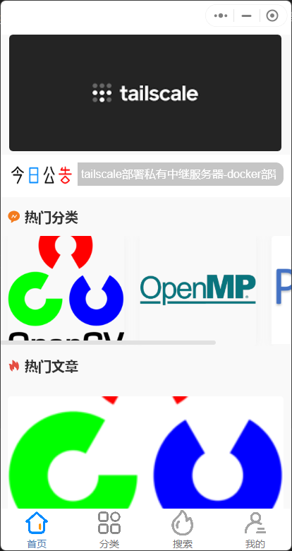
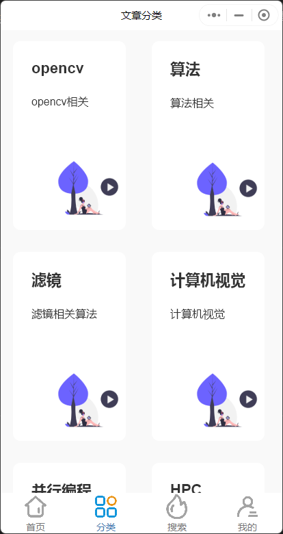
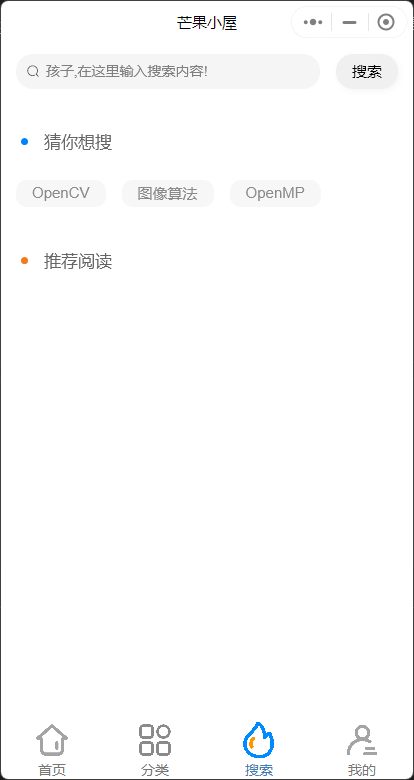
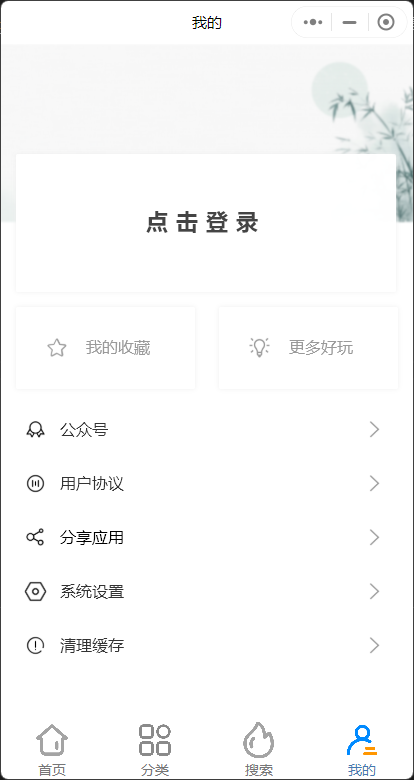
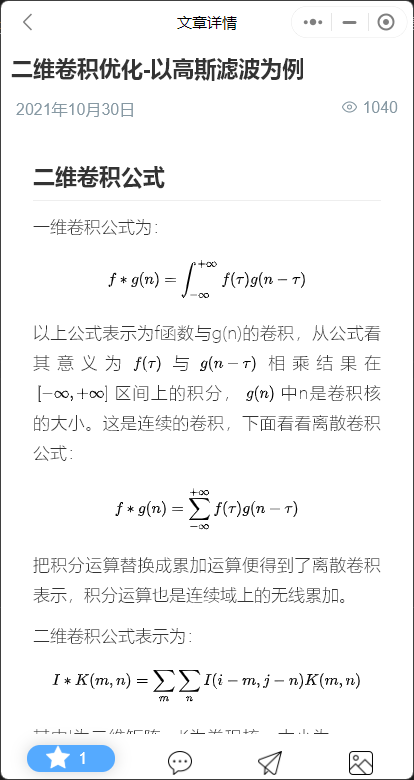
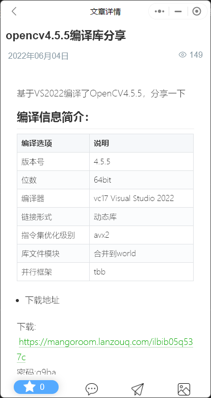

# wechat-typecho

本项目基于[Pisces-Mini-Program](https://gitee.com/Byclemon/Pisces-Mini-Program)的基础上进行二次开发，基于[towxml](https://github.com/sbfkcel/towxml)替换markdown的解析引擎，实现了博客markdown文章数据中的数学公式解析渲染效果。扫描下方二维码可以预览效果：


## 功能特性

本项目基于[Pisces-Mini-Program](https://gitee.com/Byclemon/Pisces-Mini-Program)的基础上进行二次开发，所以继承原项目所有功能

- 首页热门文章分类
- 首页热门文章
- 搜索页
- 分类页
- 收藏文章功能
- 评论功能

**在此基础上，支持markdown数学公式的解析，markdown排版渲染效果更出色。**

### 渲染效果








## 如何部署

本项目部署测试环境为

- typecho1.2正式版
- php7.2

### 后端插件

将后端插件上传至typecho的插件目录，登入后台设置即可。必须设置的选项有

- 小程序appid
- apisec密钥，这个与小程序前端要保持一致
- 热门分类设置格式为
```
分类名称1|分类1mid|分类1封面图片地址
分类名称2|分类2mid|分类2封面图片地址
...
```
### latex解析服务器

towxml实现对数学公式解析的方式是通过部署后台服务器将公式

### 适配编译本项目

#### 需要修改适配的地方

1. manifest.json 

```json
{
    "name" : "芒果小屋", //改为自己小程序名称
    "appid" : "__UNI__EAB0F35",
    "description" : "",
    "versionName" : "芒果小屋",//改为自己小程序名称
    "versionCode" : 214,
    "transformPx" : false,
...
```

2. pagee.json

```json
//...
"globalStyle": {
    "mp-alipay": {
        /* 支付宝小程序特有相关 */
        "transparentTitle": "always",
        "allowsBounceVertical": "NO"
    },
    "navigationBarBackgroundColor": "#ffffff",
    "navigationBarTitleText": "芒果小屋",//改为自己小程序名称
    "navigationBarTextStyle": "black"
},
//...
```

3. project.private.config.json

```json
{
  "appid": "wx676c70d70f0810ae",//改为自己小程序的appid,可以通过微信开发者工具获取
  "compileType": "miniprogram",
  "libVersion": "2.24.6",
  "packOptions": {
    "ignore": [],
    "include": []
  },
  "setting": {
//...
```

4. utils/api.js

```js
var domain = "mangoroom.cn"; //改为自己的博客域名
var apisec = "xxx"; //改为博客插件中的apisec密钥
var API_URL = 'https://' + domain + '/api/';
//...
```


5. static/towxml/config.js

```json
// 数学公式解析API
latex:{
    api:'http://towxml.vvadd.com/?tex'  //替换为自己的解析服务地址
},

// yuml图解析APPI
yuml:{
    api:'http://towxml.vvadd.com/?yuml' //替换为自己的解析服务地址
},
```

完成以上修改配置后，就可以使用uni-app的开发工具与微信开发工具编译运行了。

## 致谢

- [@成都第七帅](https://github.com/cddqssc/WeTypecho), 最早开发了WeTypecho项目，后续大部分开源项目都是基于此版本修改的，本项目的后端插件也是。
- [@Byclemon](https://gitee.com/Byclemon/Pisces-Mini-Program), 开发uni-app版本，本项目在此基础上修改。
- [@sbfkcel](https://github.com/sbfkcel)， 开发的towxml提供了markdown解析引擎。

